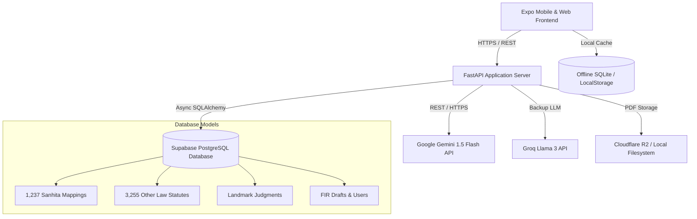

# ⚖️ IPC.ai — Next-Gen Indian Legal Intelligence Platform

<div align="center">

[](https://fastapi.tiangolo.com)
[](https://expo.dev)
[](https://www.python.org)
[](https://www.typescriptlang.org)
[](https://supabase.com)
[](LICENSE)

**A comprehensive, offline-capable AI legal assistant, statutory converter, and legal intelligence suite built for Indian law enforcement, practicing advocates, judges, and citizens.**

[Key Features](#-key-features) • [Architecture](#-system-architecture) • [Tech Stack](#-tech-stack) • [Quick Start](#-quick-start) • [Deployment](#-cloud-deployment-guide) • [API Reference](#-api-endpoints)

---

</div>

## 🌟 Overview

On July 1, 2024, India replaced its colonial-era criminal laws with the **Bharatiya Nyaya Sanhita (BNS)**, **Bharatiya Nagarik Suraksha Sanhita (BNSS)**, and **Bharatiya Sakshya Adhiniyam (BSA)**.

**IPC.ai** bridges the transition by providing instant bidirectional cross-referencing between old and new laws, AI-powered legal synthesis with statutory citations, offline-capable FIR drafting with ReportLab PDF generation, precedent judgment discovery, a directory of 3,255+ statutory bare acts, and an end-to-end Lawyer Practice Workspace.

---

## 🚀 Key Features

### 🧠 1. Multi-Mode Legal AI Workspace
- **Three Dedicated Intelligence Modes**:
  - **Legal Advice**: Synthesizes factual scenarios into actionable legal counsel with relevant statutory citations.
  - **Case Strategy**: Outlines procedural roadmaps, bail eligibility, evidentiary burdens, and litigation tactics.
  - **Judgment AI**: Surfaces binding Supreme Court & High Court precedents matching facts and legal issues.
- **Rich Markdown Formatting**: Beautifully rendered statutory headers, bulleted rationales, section badges, and court citations via a custom `MarkdownRenderer`.
- **Hybrid AI Fallback**: Multi-tier RAG execution powered by Google Gemini REST API, Groq Llama 3 models, and remote PostgreSQL semantic search.

### 🔄 2. Complete Sanhita Converter (BNS ↔ IPC, BNSS ↔ CrPC, BSA ↔ IEA)
- **1,237 Exact Mappings**: Bidirectional lookup for offenses, changes in punishment, cognizable/bailable classifications, and compounded sections.
- **Smart Ascending Sorting**: Natural alphanumeric section sorting (e.g., Section 4 $\rightarrow$ 302 $\rightarrow$ 304A $\rightarrow$ 304B $\rightarrow$ 376D).
- **Offline Synced Storage**: Instant lookup via local SQLite / web storage cache with cloud sync.

### 📚 3. National Bare Acts & State Laws Directory (3,255+ Provisions)
- **Central & State Acts**: 3,255 indexed provisions spanning Central Acts, 376 State Acts (Maharashtra, Delhi, Karnataka, UP, etc.), Commercial Laws, and Procedural Codes.
- **Fast Search & Filter**: Filter by category, enacted year, keyword, and jurisdiction.
- **Direct Navigation**: Deep-linking directly from home screen categories.

### 📝 4. Law Enforcement FIR Drafting Engine
- **Step-by-Step Guided Form**: Structured wizard capturing complainant details, accused information, incident timeline, offenses, and narrative.
- **Dynamic PDF Generation**: Generates compliant Indian Police FIR sheets in PDF format with barcodes and official stamps using `ReportLab`.
- **Cloud Storage**: Automatic upload to Cloudflare R2 / S3 storage with local fallback.

### 💼 5. Advocate & Lawyer Practice Workspace
- **Case Management Tracker**: Track active cases, CNR numbers, opposing counsel, and bench details.
- **Hearing Calendar**: Upcoming case dates with countdown alerts and push notifications.
- **Client & Billing Directory**: Contact logs, retainers, and fee status tracking.
- **Interactive Kanban Boards**: Prioritize daily drafts, filings, and court appearances.

### 🗳️ 6. Community Legal Poll & Mastery Quiz
- **Daily Interactive Poll**: Vote on controversial statutory amendments (e.g., Section 105 BNSS digital evidence seizure), view live percentage breakdowns, and read statutory analyses.
- **5-Question Legal Mastery Quiz**: Test knowledge of criminal and data protection laws with instant feedback, statutory explanations, score counters, and rank titles.

### 📖 7. Legal Dictionary & Consumer Grievances
- **Bilingual Legal Dictionary**: English and Hindi definitions for Latin legal maxims, procedural terminology, and constitutional phrases.
- **Consumer & Cyber Complaints**: Direct filing guides for NCH, Cyber Crime Portal (1930), and RBI Ombudsman.

---

## 🏗 System Architecture



---

## 🛠 Tech Stack

### Frontend (Mobile & Web)
- **Framework**: [Expo SDK 52](https://expo.dev) + [React Native 0.76](https://reactnative.dev)
- **Routing**: [Expo Router v4](https://docs.expo.dev/router/introduction/) (file-based navigation)
- **Language**: TypeScript 5.3+
- **Styling**: Vanilla React Native StyleSheet + Custom Design System Tokens (Dark & Light)
- **State & Data**: TanStack React Query v5
- **Local Storage**: `expo-sqlite` (Android/iOS) + `db.web.ts` (`localStorage` on Web)
- **Secure Auth**: `expo-secure-store`
- **Markdown**: Custom AST tokenizer with native text and link handling

### Backend (API & Engine)
- **Framework**: [FastAPI](https://fastapi.tiangolo.com) (Python 3.11 / 3.12)
- **Server**: [Uvicorn](https://www.uvicorn.org) ASGI
- **ORM / Database**: [SQLAlchemy](https://www.sqlalchemy.org) (AsyncIO) with `asyncpg` + [Supabase PostgreSQL](https://supabase.com)
- **AI / LLM Integration**: Direct `httpx` async client for Google Gemini REST API & Groq Cloud
- **Security**: JWT (`pyjwt` / `python-jose`) + `passlib` (bcrypt)
- **Document Engine**: `ReportLab` for automated FIR PDF generation
- **Object Storage**: AWS S3 / Cloudflare R2 via `boto3`

---

## 📦 Repository Structure

```text
IPC-AI/
├── backend/                        # FastAPI Application
│   ├── src/
│   │   ├── api/                   # Route handlers (legal, fir, compare, judgments, etc.)
│   │   ├── core/                  # Security, config, database session managers
│   │   ├── models/                # SQLAlchemy database models
│   │   ├── schemas/               # Pydantic request/response schemas
│   │   ├── services/              # RAG service, PDF generator, storage service
│   │   └── main.py                # FastAPI entry point
│   ├── data/                      # Bundled statutory datasets & mappings
│   ├── scripts/                   # Scraping and batch database ingestion tools
│   ├── Dockerfile                 # Container image specification
│   ├── render.yaml                # 1-Click Render.com deployment blueprint
│   ├── requirements.txt           # Python dependencies
│   └── .env.example               # Backend configuration template
│
├── mobile/                         # Expo React Native App
│   ├── app/                       # Expo Router application screens
│   │   ├── (tabs)/                # Main tab navigator (Dashboard, Converter, FIR, More)
│   │   ├── bare-act.tsx           # Full bare acts reader
│   │   ├── complaints.tsx         # Citizen grievance redressal guide
│   │   ├── lawyers.tsx            # Lawyer workspace & directory
│   │   └── other-law.tsx          # 3,255 provision statutory browser
│   ├── components/                # UI components (MarkdownRenderer, Card, ChatBubble)
│   ├── constants/                 # Theme tokens and layout metrics
│   ├── lib/                       # API clients, auth helpers, hybrid SQLite driver
│   ├── eas.json                   # EAS Build profiles (Android APK/AAB, iOS IPA)
│   ├── vercel.json                # Vercel SPA routing configuration
│   └── package.json               # Frontend dependencies & scripts
│
├── docker-compose.yml              # Multi-container orchestration
├── .gitignore                      # Monorepo git exclusion rules
└── README.md                       # Project documentation
```

---

## ⚡ Quick Start

### 1. Prerequisites
- **Node.js**: v18.0.0 or later
- **Python**: v3.11 or later
- **Git**

### 2. Backend Setup
```bash
# Clone the repository
git clone https://github.com/SarwadnyaMahajan/IPC-AI.git
cd IPC-AI/backend

# Create and activate Python virtual environment
python -m venv venv

# On Windows:
venv\Scripts\activate
# On Linux/macOS:
source venv/bin/activate

# Install dependencies
pip install -r requirements.txt

# Configure environment variables
cp .env.example .env
# Edit .env and supply your GEMINI_API_KEY and DATABASE_URL

# Start the development server
python -m uvicorn src.main:app --reload --host 0.0.0.0 --port 8000
```
Interactive Swagger documentation will be available at: **`http://localhost:8000/docs`**

### 3. Frontend Setup
```bash
cd ../mobile

# Install NPM packages
npm install

# Option A: Run in Web Browser
npm run web

# Option B: Run on Android Emulator or Physical Device (Expo Go)
npx expo start
```

---

## ☁️ Cloud Deployment Guide

### A. Deploy Backend to Render.com (1-Click)
1. Fork or push this repository to GitHub.
2. Log in to [Render.com](https://render.com) and click **New** $\rightarrow$ **Blueprint**.
3. Connect your repository. Render will automatically detect [`backend/render.yaml`](file:///d:/Code/vivek/IPC.AI_2/backend/render.yaml).
4. Add your environment variables in the Render dashboard:
   - `DATABASE_URL`: Your Supabase connection string (`postgresql+asyncpg://...`)
   - `GEMINI_API_KEY`: Your Google AI Studio API key
   - `SECRET_KEY`: Random 32+ character string
5. Click **Apply**. Your backend will be live at `https://your-app.onrender.com`.

### B. Deploy Web App to Vercel
1. Log in to [Vercel](https://vercel.com) and click **Add New Project**.
2. Select your repository and configure:
   - **Root Directory**: `mobile`
   - **Framework Preset**: Other
   - **Build Command**: `npx expo export -p web`
   - **Output Directory**: `dist`
3. Add Environment Variable:
   - `EXPO_PUBLIC_API_URL`: `https://your-backend.onrender.com`
4. Click **Deploy**.

### C. Build Android APK with Expo EAS
```bash
cd mobile

# Install EAS CLI globally
npm install -g eas-cli

# Log in to your Expo account
eas login

# Configure project
eas build:configure

# Build standalone Android APK
eas build -p android --profile preview
```

### D. Single-Command Self-Hosted VPS Deployment (Docker Compose)
```bash
# From the repository root
docker compose up -d --build
```

---

## 📡 API Endpoints

| Method | Endpoint | Description | Auth Required |
|---|---|---|---|
| `POST` | `/api/v1/auth/register` | User, Lawyer, or Police registration | Optional for public |
| `POST` | `/api/v1/auth/login` | JWT login with access & refresh tokens | No |
| `GET` | `/api/v1/compare/search` | Search IPC ↔ BNS section mappings | No |
| `GET` | `/api/v1/compare/bns/{section}` | Get BNS section details & IPC equivalent | No |
| `POST` | `/api/v1/legal/query` | RAG legal AI advice with section citations | No (Guest allowed) |
| `POST` | `/api/v1/legal/suggest-sections` | Suggest applicable BNS/BNSS/BSA sections | No (Guest allowed) |
| `GET` | `/api/v1/judgments/search` | Search Indian court judgments by keyword | No (Guest allowed) |
| `GET` | `/api/v1/other-law` | Query 3,255 national and state bare acts | No |
| `GET` | `/api/v1/dictionary` | Search bilingual legal terminology & maxims | No |
| `POST` | `/api/v1/fir/` | Create a new First Information Report draft | Yes |
| `GET` | `/api/v1/fir/{id}/pdf` | Generate and download official FIR PDF | Yes |

---

## 🧪 Testing

```bash
# Run backend tests
cd backend
pytest tests/ -v

# Run frontend type checking
cd ../mobile
npx tsc --noEmit
```

---

## 🛡️ License

This project is open-source software licensed under the [MIT License](LICENSE).
